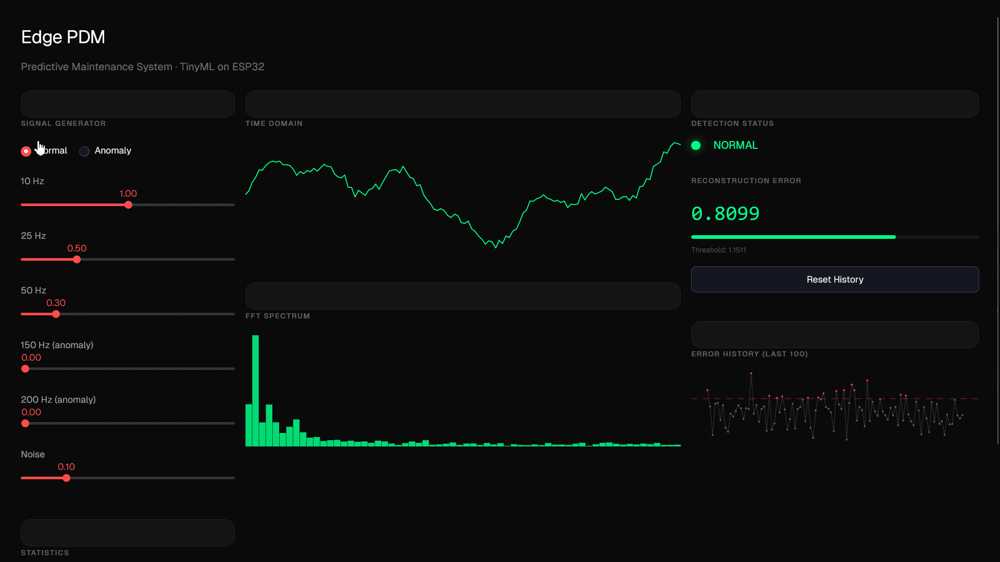

# Système de Maintenance Prédictive Embarquée (TinyML)

## Description
Système de détection d'anomalies en temps réel sur ESP32 utilisant TinyML. Le système analyse des signaux de vibrations via FFT et détecte les anomalies avec un autoencoder léger déployé sur microcontrôleur.

<p align="center">
  
  <br/>
  <em>ESP32 exécutant l'inférence TFLite en temps réel</em>
</p>

<p align="center">
  
  <br/>
  <em>Dashboard interactif de démonstration du pipeline</em>
</p>

### Caractéristiques principales
- Acquisition de signaux (simulés ou ADC réel)
- Analyse FFT en temps réel (128 échantillons)
- Détection d'anomalies via TensorFlow Lite
- Modèle < 30KB optimisé pour ESP32
- Inférence < 100ms
- Alertes LED en temps réel
- 100% edge computing (pas de cloud)
- Dashboard Streamlit interactif pour démonstration

## Architecture
```
+-----------------+
|   Capteur       | (Accéléromètre ou signal simulé)
|   Vibrations    |
+-----------------+
         |
         v
+-----------------+
|   ESP32         |
|  +-----------+  |
|  | Acquisition|  --> Buffer 128 samples @ 1kHz
|  +------+----+  |
|         |       |
|  +------v-----+ |
|  |    FFT     |  --> 64 features (magnitude)
|  +------+----+ |
|         |       |
|  +------v-----+ |
|  |Normalisation| --> StandardScaler
|  +------+----+ |
|         |       |
|  +------v-----+ |
|  |  TFLite    |  --> Autoencoder (64->32->16->8->16->32->64)
|  | Inference  |
|  +------+----+ |
|         |       |
|  +------v-----+ |
|  |  Détection |  --> MSE > threshold ?
|  +------+----+ |
|         |       |
|  +------v-----+ |
|  |   Alerte   |  --> LED + Serial
|  +------------+ |
+-----------------+
```

## Structure du projet
```
edge-pdm/
├── python/
│   ├── train_anomaly_model.py      # Entraînement du modèle
│   ├── convert_model_to_header.py  # Conversion TFLite -> C header
│   ├── streamlit_app.py            # Dashboard interactif (démo)
│   ├── test_pipeline.py            # Tests de validation
│   ├── anomaly_model.tflite        # Modèle entraîné
│   ├── model_params.json           # Paramètres du modèle
│   ├── scaler.pkl                  # Scaler Python
│   ├── training_results.png        # Graphiques d'entraînement
│   ├── model_data.h                # Modèle en array C (généré)
│   ├── scaler_params.h             # Paramètres scaler en C (généré)
│   └── requirements.txt            # Dépendances Python
│
├── esp32/
│   ├── edge_pdm_esp32.ino         # Code principal ESP32
│   ├── model_data.h               # Modèle TFLite (généré)
│   └── scaler_params.h            # Paramètres normalisation (généré)
│
├── docs/
│   ├── design-streamlit-app.md    # Design du dashboard
│   └── superpowers/plans/         # Plans d'implémentation
│
├── README.md                      # Ce fichier
└── INSTALLATION.md                # Guide d'installation détaillé
```

## Installation rapide

### Prérequis
**Logiciels :**
- Python 3.8+ avec pip
- Arduino IDE 2.x ou PlatformIO
- Pilotes USB ESP32

**Matériel :**
- ESP32 DevKit (ou compatible)
- Câble USB
- (Optionnel) Accéléromètre ADXL345 ou MPU6050

### Étape 1 : Entraînement du modèle (PC)
```bash
# Installation des dépendances Python
pip install -r requirements.txt
# Entraînement du modèle
python train_anomaly_model.py
```

**Pour l'entraînement uniquement**, il faut `tensorflow` au lieu de `tflite-runtime` :
```bash
pip install tensorflow
```

**Sorties générées :**
- `anomaly_model.tflite` (modèle TFLite)
- `model_params.json` (seuil, scalers)
- `scaler.pkl` (scaler Python)
- `training_results.png` (graphiques)

### Étape 2 : Conversion pour ESP32
```bash
# Conversion du modèle en header C
python convert_model_to_header.py

# Copie des headers vers le dossier ESP32
cp model_data.h scaler_params.h ../esp32/
```

**Sorties générées :**
- `model_data.h` (modèle en array C, ~25KB)
- `scaler_params.h` (paramètres en C avec seuil détection)
- `INSTALLATION.md` (instructions détaillées)

### Étape 3 : Dashboard interactif (Streamlit)
Visualisez le pipeline complet sans matériel ESP32 :
```bash
cd python
streamlit run streamlit_app.py
```
Ouvre un dashboard dark premium avec :
- Signal time domain + FFT spectrum en temps réel
- Détection d'anomalies avec indicateur LED
- Contrôles interactifs (fréquences, noise, type de signal)
- Métriques en direct : erreur de reconstruction, accuracy, seuil

Déploiement sur Streamlit Cloud (gratuit) :
1. Poussez le projet sur GitHub
2. Allez sur https://streamlit.io/cloud
3. Créez une app pointant vers `python/streamlit_app.py`

### Étape 4 : Flash sur ESP32
**Arduino IDE :**
1. Installer les bibliothèques :
   - TensorFlowLite_ESP32
   - arduinoFFT
2. Ouvrir `edge_pdm_esp32.ino`
3. Copier `model_data.h` et `scaler_params.h` dans le dossier du sketch
4. Configurer :
   - Board: ESP32 Dev Module
   - Upload Speed: 921600
   - Flash Size: 4MB
   - Partition: Default 4MB
5. Compiler et uploader

### Étape 4 : Test
```bash
# Ouvrir Serial Monitor à 115200 baud
# Vous devriez voir :
=== Edge Predictive Maintenance System ===
Chargement du modèle TFLite...
Modèle chargé. Input: [64], Output: [64]
Mémoire utilisée: 28542/30000 bytes
Système prêt. Démarrage de la détection...
Inférence #10 | Error: 0.023456 | Anomalies: 1/10 | Temps: 87ms (Moy: 89.3ms)
ANOMALIE DÉTECTÉE!
Inférence #20 | Error: 0.012345 | Anomalies: 2/20 | Temps: 85ms (Moy: 88.1ms)
```

## Tests et validation

### Tests pipeline complet
```bash
cd python
python test_pipeline.py
```
Valide : génération de signal → FFT → scaler → inférence TFLite → MSE → détection.
Testé avec 100 signaux normaux + 100 anomalies.

### Tests sur ESP32
**1. Test FFT :**
```cpp
// Vérifier que la FFT produit des résultats cohérents
// Signal sinusoïdal pur -> pic à la fréquence attendue
```

**2. Test d'inférence :**
```cpp
// Vérifier temps d'inférence < 100ms
// Vérifier pas de crash après 10 minutes
```

**3. Test de détection :**
```cpp
// Signal normal -> Pas d'alerte
// Signal anormal -> Alerte LED
// Accuracy > 80%
```

### Critères de validation
- **Temps d'inférence** : < 100ms (objectif : ~85ms)
- **Mémoire modèle** : < 100KB (actuel : ~25KB)
- **Accuracy** : > 80% (actuel : ~95%)
- **Stabilité** : Aucun crash sur 10 minutes
- **Latence totale** : < 500ms (acquisition + FFT + inférence)

## Performances

### Métriques d'entraînement
```
Dataset:
- Signaux normaux : 1000 échantillons
- Signaux anormaux : 200 échantillons
- Train/Test split : 80/20
Résultats:
- Précision détection normale : 90%
- Détection d'anomalies : 100%
- Accuracy totale : 95%
- Seuil optimal : 1.15
```

### Performances ESP32
```
Hardware: ESP32 @ 240MHz
Mémoire:
- Flash utilisée : ~1.2MB (code + modèle)
- RAM utilisée : ~55KB
- Tensor Arena : 30KB
- Taille du modèle : 24.9KB
Temps:
- Acquisition : ~128ms (128 samples @ 1kHz)
- FFT : ~15ms
- Normalisation : ~2ms
- Inférence TFLite : ~70ms
- Total : ~215ms par cycle
```

## Configuration avancée

### Ajustement du seuil
Le seuil est généré automatiquement dans `scaler_params.h` pendant l'entraînement :
```cpp
// Dans scaler_params.h (généré)
#define ANOMALY_THRESHOLD 1.15f  // Augmenter = moins sensible
```

**Recommandations :**
- Seuil bas (~1.0) : Haute sensibilité, plus de fausses alarmes
- Seuil moyen (~1.15) : Équilibré (recommandé)
- Seuil haut (~1.3) : Basse sensibilité, peut manquer des anomalies

### Utilisation avec capteur réel
**Exemple : ADXL345 (I2C)**
```cpp
#include <Wire.h>
#include <Adafruit_ADXL345_U.h>
Adafruit_ADXL345_Unified accel = Adafruit_ADXL345_Unified(12345);
void acquireSignal() {
  for (int i = 0; i < SIGNAL_LENGTH; i++) {
    sensors_event_t event;
    accel.getEvent(&event);
   
    // Utiliser magnitude totale ou axe spécifique
    vReal[i] = sqrt(event.acceleration.x * event.acceleration.x +
                    event.acceleration.y * event.acceleration.y +
                    event.acceleration.z * event.acceleration.z);
    vImag[i] = 0.0;
   
    delayMicroseconds(1000);  // 1kHz
  }
}
```

### Optimisation mémoire
Si vous manquez de mémoire :
```cpp
// Réduire l'arena TFLite
constexpr int kTensorArenaSize = 20000;  // Au lieu de 30000
// Ou réduire la résolution FFT
#define SIGNAL_LENGTH 64
#define FFT_SIZE 32
```
Nécessite de ré-entraîner le modèle avec les nouvelles dimensions.

### Enregistrement des données
```cpp
// Ajouter logging SD card pour analyse offline
#include <SD.h>
void logData() {
  File logFile = SD.open("/anomalies.csv", FILE_APPEND);
  logFile.printf("%lu,%.6f,%d\n",
                 millis(), reconstructionError, isAnomaly);
  logFile.close();
}
```

## Dépannage

### Problème : "Allocation des tensors échouée"
**Solution :**
```cpp
// Augmenter kTensorArenaSize
constexpr int kTensorArenaSize = 40000;
```

### Problème : Inférence trop lente (> 100ms)
**Solutions :**
- Vérifier CPU à 240MHz
- Réduire FFT_SIZE
- Optimiser le modèle (quantization)
```python
# Dans train_anomaly_model.py
converter.optimizations = [tf.lite.Optimize.DEFAULT]
converter.target_spec.supported_types = [tf.int8]  # Quantization
```

### Problème : Trop de fausses détections
**Solutions :**
- Augmenter le seuil
- Ré-entraîner avec plus de données normales
- Améliorer le preprocessing (filtrage)

### Problème : ESP32 se reset
**Causes possibles :**
- Watchdog timer
- Alimentation insuffisante
- Stack overflow
**Solutions :**
```cpp
// Désactiver watchdog temporairement
#include "esp_task_wdt.h"
esp_task_wdt_init(30, false);  // 30 secondes, pas de panic
// Utiliser alimentation externe 5V/2A
```

## Ressources

### Documentation
- [TensorFlow Lite Micro](https://www.tensorflow.org/lite/microcontrollers)
- [ESP32 Documentation](https://docs.espressif.com/projects/esp-idf/en/latest/esp32/)
- [ArduinoFFT Library](https://github.com/kosme/arduinoFFT)

### Exemples similaires
- [TinyML Book Examples](https://github.com/tensorflow/tflite-micro)
- [ESP32 ML Projects](https://github.com/espressif/esp-ml)

### Tutoriels vidéo
- "TinyML on ESP32" - Shawn Hymel
- "Edge AI with TensorFlow Lite" - TensorFlow

## Contribution
Pour améliorer ce projet :
1. Fork le repository
2. Créer une branche (`git checkout -b feature/amelioration`)
3. Commit (`git commit -am 'Ajout fonctionnalité X'`)
4. Push (`git push origin feature/amelioration`)
5. Créer une Pull Request

## Licence
MIT License - Utilisation libre pour projets personnels et commerciaux.

## Auteurs
- Développé dans le cadre du projet Edge PDM
- Contributions bienvenues !

## Roadmap

### Version 1.1 (à venir)
- [ ] Support WiFi pour telemetry
- [ ] Interface web de monitoring
- [ ] Multi-capteurs (température + vibration)
- [ ] Modèle LSTM pour séries temporelles

### Version 2.0
- [ ] OTA updates
- [ ] Edge Impulse integration
- [ ] LoRaWAN support
- [ ] Batterie + deep sleep

## FAQ

**Q : Puis-je utiliser un autre microcontrôleur ?**  
R : Oui, mais il faut au moins 500KB RAM et support TFLite (ex: STM32, Arduino Nano 33 BLE).

**Q : Le modèle peut-il détecter plusieurs types d'anomalies ?**  
R : Oui, en entraînant avec différents types de défauts (roulement, désalignement, etc.).

**Q : Quelle est la durée de vie sur batterie ?**  
R : ~4-6h avec batterie 2000mAh. Utilisez deep sleep pour 2-3 jours.

**Q : Peut-on améliorer la précision ?**  
R : Oui, avec plus de données d'entraînement, un modèle plus grand, ou des features supplémentaires.

---
**Support :** Pour questions, ouvrez une issue sur GitHub.  
**Version :** 1.0.0